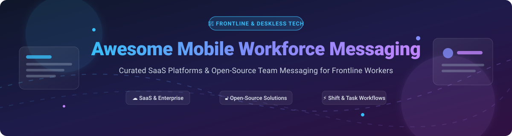

  
  
  
  
  

  

# 📱 Awesome Mobile Workforce Messaging 🚀

> **Curated Directory of Enterprise SaaS Platforms & Open-Source GitHub Software for Deskless, Operational & Frontline Worker Team Communications.**

📅 **Last updated: October 2026**

Welcome to the definitive guide on **Mobile Workforce Messaging**, **Frontline Employee Engagement Software**, and **Self-Hosted Team Collaboration Apps**. Designed specifically for deskless teams across manufacturing, retail, logistics, hospitality, healthcare, and field services.

---

## 📖 Table of Contents

- [☁️ SaaS / Enterprise Hosted Platforms](#️-saas--enterprise-hosted-platforms)
- [🔓 Open-Source GitHub Projects](#-open-source-github-projects)
- [💖 Support & Sponsorship](#-support--sponsorship)
- [🤝 How to Contribute](#-how-to-contribute)
- [⚠️ Disclaimer & Compliance](#️-disclaimer--compliance)
- [📊 Star History](#-star-history)

---

## ☁️ SaaS / Enterprise Hosted Platforms

> **📊 Market Context & Industry Dynamics**: The global mobile workforce messaging and frontline employee software market is valued at **~$5B in 2026**, projected to expand toward **~$12B by 2032**. The market remains **moderately fragmented** with no single vendor dominating the deskless worker category. **Staffbase** and **Beekeeper** lead high-touch enterprise deployment, **Blink** targets SMB affordability, and **Microsoft** leverages Teams / Viva Engage bundling.
>
> 📌 **Important Lifecycle Updates**: **Microsoft Kaizala was retired on August 31, 2023** (migrated to Microsoft Teams). **Workplace from Meta is shutting down permanently on June 1, 2026** (with Workvivo by Zoom as Meta's designated preferred partner).

| 🏢 Platform | 📝 Description | 💵 Pricing (Starting Tier) | 🎁 Free Tier / Trial Limits | 📊 Company Size (Revenue / Valuation) |
|:---|:---|:---|:---|:---|
| **[Microsoft Kaizala](https://products.office.com/en/business/microsoft-kaizala)** | **Microsoft's mobile-first messaging app.** Chat, surveys, and workflow tools for deskless workers. **Retired August 31, 2023**. | **Retired** (migrated to Teams; Teams starts at **$4.00/user/month** for Essentials) | **Retired** (Teams Free: **60 min group calls, 100 participants, 5 GB storage/user**) | **~$281B revenue (Microsoft FY2025)** |
| **[Workplace from Meta](https://forwork.meta.com/)** | **Enterprise social network.** Groups, chat, and live video for frontline workers. **Closing June 1, 2026**. | **Closing** (was **$4.00/user/month** Core tier; Workvivo partner starting tier on request) | **Closing** (30-day free trial previously available, no perpetual free tier) | **Part of Meta (~$165B revenue)** |
| **[Staffbase](https://staffbase.com/)** | **AI-native employee experience platform.** Mobile app, intranet, and AI services for all employees. | **$8.00–$15.00/user/year** (mid-market tier; **$25,000 minimum contract**) | **30-day free trial** (custom environment test, no perpetual free tier) | **Private (~$500M+ valuation est.)** |
| **[Beekeeper](https://www.beekeeper.io/)** | **Frontline worker communication platform.** Messaging, workflows, shift management, and document sharing. | **$4.00/user/month** (Essential tier starting price) | **Free tier**: **Up to 30 users**, 10 docs (10 MB each), 10 chat files/day, 5 workflows; **14-day Premium trial** | **Private (~$100M+ raised)** |
| **[Yoobic](https://www.yoobic.com/)** | **Digital workplace for frontline teams.** Task management, communication, and micro-learning. | **$1.00/user/month** (starting price per module) | **14-day interactive sandbox demo** (no perpetual free tier) | **Private (~$100M+ raised)** |
| **[Blink](https://www.joinblink.com/)** | **Mobile-first employee engagement platform.** Secure messaging, content sharing, HR workflows, and analytics for frontline workers. | **$5.00/user/month** (Core tier) | **14-day free trial** (unlimited features, no credit card required, no perpetual free tier) | **Private (~$50M+ raised)** |
| **[Actimo](https://www.actimo.com/)** | **Employee communication and engagement platform.** Messaging, surveys, and training for deskless teams. | **€2.99/user/month** (~$3.25/user/month, minimum 200 users) | **14-day free trial** (full access, no credit card required, no perpetual free tier) | **Part of Kahoot! (~$90M revenue)** |
| **[Speakap](https://www.speakap.com/)** | **Communication platform for frontline workers.** Messaging, news, and workflows with AI features. | **~$3.00/user/month** (starting plan entry rate) | **14-day free trial** (unlimited features, no perpetual free tier) | **Private (~$15M+ raised)** |
| **[Crew](https://crew.you/)** | **AI-powered workforce messaging.** Conversations, tools, and integrations for teams. | **$20.00/month** (Basic tier flat rate) | **Free tier**: **15 conversations/day**, 1 messenger connection, built-in tools | **Private (Crew)** |
| **[Zinc](https://www.zincwork.com/)** | **Field workforce communication.** Text messages, audio clips, and voice/video calling for field employees. | **$0.01/user/month** (starting micro-tier entry rate) | **Free tier**: **Basic 1:1 text & voice chat** for small field teams; **30-day enterprise trial** | **Private (Zinc)** |

---

## 🔓 Open-Source GitHub Projects

The self-hosted and open-source workforce messaging ecosystem provides data sovereignty, air-gapped readiness, and deep ERP integration.

*The table below is sorted by **GitHub Stargazers (Descending)**:*

| 📦 Repository | 🌟 Star Badge | 📝 Description & Highlights |
|:---|:---|:---|
| **[Rocket.Chat](https://github.com/RocketChat/Rocket.Chat)** |  | **Self-hosted communication platform for secure environments.** Starter plan free for up to 50 users. MIT licensed Community edition. DoD ATO up to IL6 for classified defense environments. Federation for cross-agency communication. |
| **[Mattermost](https://github.com/mattermost/mattermost)** |  | **Secure collaboration platform for mission-critical work.** Free Entry edition for 25–50 users with messaging, playbooks, boards, and AI agents. Designed for defense and air-gapped infrastructure. |
| **[Zulip](https://github.com/zulip/zulip)** |  | **Organized team chat with unique topic-based threading.** 100% open-source codebase under Apache 2.0. Free Zulip Cloud Standard for open-source and non-profits. |
| **[Element Web / Matrix](https://github.com/element-hq/element-web)** |  | **Open-source Matrix client & deployment for decentralized messaging.** End-to-end encrypted messaging, voice/video calls, and cross-platform federation. |
| **[Nextcloud Talk](https://github.com/nextcloud/spreed)** |  | **Chat, video, and audio integrated into Nextcloud.** Completely free and open-source self-hosted audio/video calls, screen sharing, and group chat with no user account limits. |
| **[Matrix Synapse](https://github.com/element-hq/synapse)** |  | **Reference Matrix homeserver implementation.** Powers decentralized, secure, and bridged messaging backbones for frontline and enterprise networks. |
| **[Raven](https://github.com/frappe/raven)** |  | **Enterprise-first messaging built on Frappe Framework.** DMs, channels, threads, reactions, mobile app, and deep ERPNext integration for sharing documents & triggering workflow events. Includes Raven AI agents. |
| **[Campfire](https://github.com/basecamp/campfire)** |  | **Super simple group chat requiring no subscription.** MIT licensed, self-hosted lightweight chat alternative for operational teams. |
| **[Centaur](https://github.com/paradigmxyz/centaur)** |  | **Virtual employee and automated operations bot framework.** Runs inside team chat or APIs. Self-hostable for secure workflows. |
| **[Buzz (Block)](https://github.com/block/buzz)** |  | **Open-source group chat for humans and AI agents.** Model-agnostic, decentralized, self-sovereign team messaging platform. |

---

## 💖 Support & Sponsorship

If you find this curated list helpful for evaluating mobile workforce messaging, frontline communication tools, or open-source team chat software, please consider supporting the project!

- ⭐ **Star this repository** to help others discover it on GitHub.
- 🔀 **Fork and contribute** new open-source projects or SaaS platform updates.
- 📢 **Share with your network** on LinkedIn, X, or tech communities.
- ☕ **Buy me a coffee / Sponsor**: Support ongoing maintenance on the GitHub Sponsor Dashboard:
  
  👉 **[Sponsor on GitHub (https://github.com/sponsors/ishandutta2007)](https://github.com/sponsors/ishandutta2007)**

---

## 🤝 How to Contribute

We welcome contributions from internal comms leaders, IT admins, and open-source developers!

1. 🍴 **Fork** the repository.
2. ✏️ **Add or update** entries in `README.md` following the table schema.
3. 🔍 **Verify details**: Ensure pricing models, free tier limits, and GitHub URLs are accurate.
4. 📬 **Submit a Pull Request** with a brief explanation.

---

## ⚠️ Disclaimer & Compliance

- 🛡️ **Data Privacy**: Mobile workforce platforms handle sensitive operational data. Ensure full compliance with **GDPR**, **CCPA**, and enterprise data security regulations.
- 📢 **Vendor Changes**: Vendor pricing tiers, free trial periods, and product lifecycles change frequently. Always request a formal quote from commercial vendors.
- 📌 **Maintained List**: This is a community-curated collection under the [Awesome-Awesome-Awesome](https://github.com/ishandutta2007/Awesome-Awesome-Awesome) index.

---

## 📊 Star History

